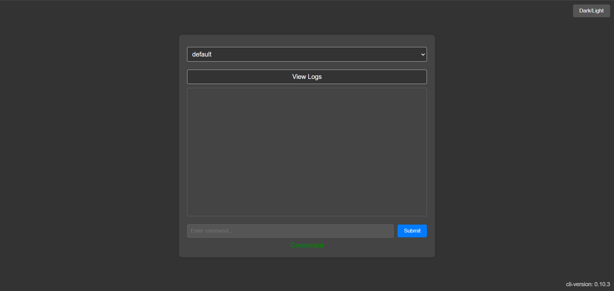

# rcon-cli-web



## Description

*rcon-cli-web* is a web GUI over [rcon-cli](https://github.com/gorcon/rcon-cli), designed to be compatible with palworld. It serves as an interface for executing queries on game servers using the RCON protocol.

## Features

- Supports multiple game servers.
- Persistent selection of server options.
- Customizable logging and timeout settings.

## Installation

To install and run *rcon-cli-web*, follow these steps:

1. Clone the repository: `git clone https://github.com/yourusername/rcon-cli-web.git`
2. Navigate to the project directory: `cd rcon-cli-web`
3. Build the project: `go build`
4. Run the compiled binary: `./rcon-cli-web`

Make sure you have Go installed and properly configured on your system before proceeding.

### Command-Line Installation

To install and run *rcon-cli-web* from the command line, follow these steps:

1. Clone the repository: `git clone https://github.com/yourusername/rcon-cli-web.git`
2. Navigate to the project directory: `cd rcon-cli-web`
3. Build the project: `go build`
4. Run the compiled binary: `./rcon-cli-web`

Make sure you have Go installed and properly configured on your system before proceeding.

#### Command-Line Flags

You can customize the behavior of *rcon-cli-web* using the following command-line flags:

| Flag               | Description                           | Default Value      |
|--------------------|---------------------------------------|--------------------|
| `-port`            | Web port                              | `3000`             |
| `-mode`            | Dark/light mode                       | `dark`             |
| `-cli-config`      | Root path to rcon.yaml                | `/config/rcon.yaml`|
| `-cli-def-server`  | Default rcon env                      | `default`          |
| `-db-json-file`    | DB JSON file                          | `/config/saved.json`|

Replace the default values as needed when running the binary.

### Docker Installation

Alternatively, you can use the Docker image hosted on GitHub. Use the following `docker-compose.yml` file:

```yaml
version: '3.8'

services:
  rcon-cli-web:
    image: ghcr.io/xstar97/rcon-cli-web:latest
    environment:
      - PORT=3000
      - MODE=dark
      - CLI_DEFAULT_SERVER=default
      - CLI_CONFIG=/config/rcon.yaml
    ports:
      - "3000:3000"
    volumes:
      - ./config:/config
```

## License

This project is licensed under the MIT License - see the [LICENSE](./LICENSE) file for details.

## Contributing

Contributions are welcome! Please see the [CONTRIBUTING.md](./CONTRIBUTING.md) file for more details.

## Acknowledgements

- [rcon-cli](https://github.com/gorcon/rcon-cli) - The underlying CLI tool for RCON communication.
- [palworld](https://palworld.gg/) - The game server platform supported by this tool.
