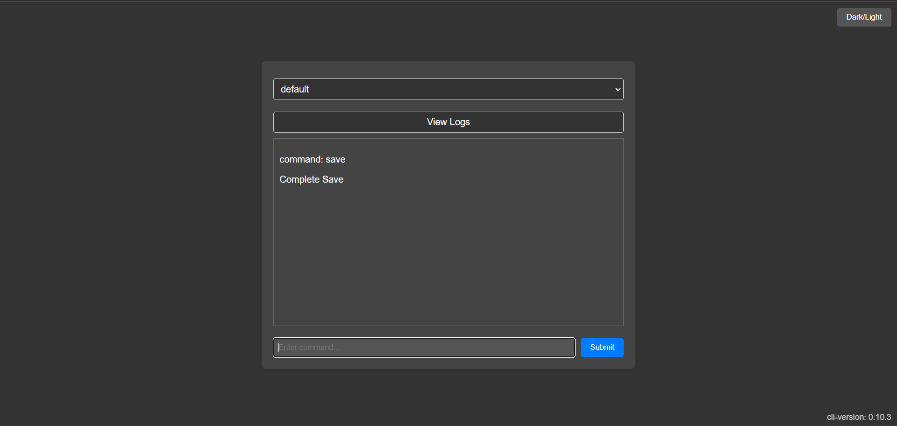

# rcon-cli-web



A web gui over [rcon-cli](https://github.com/gorcon/rcon-cli), compatible with palworld.

Create a file called rcon.yaml from the [sample](./rcon.yaml.example).

Place the rcon.yaml in the /configs directory.

the cli tool can support multiple servers if you keep the format in tact.

You can then just select the server you want from the gui.
there is a saved function so options selected will persist.

```yaml
default:
  address: "" # host:port, for example 127.0.0.1:16260
  password: ""
  log: "/config/logs/rcon-default.log"
  type: "" # rcon, telnet, web.
  timeout: "10s"
server1:
  address: "" # host:port, for example 127.0.0.1:16260
  password: ""
  log: "/config/logs/rcon-server1.log"
  type: "" # rcon, telnet, web.
  timeout: "10s"
server2:
  address: "" # host:port, for example 127.0.0.1:16260
  password: ""
  log: "/config/logs/rcon-server2.log"
  type: "" # rcon, telnet, web.
  timeout: "10s"
server3:
  address: "" # host:port, for example 127.0.0.1:16260
  password: ""
  log: "/config/logs/rcon-server3.log"
  type: "" # rcon, telnet, web.
  timeout: "10s"
```